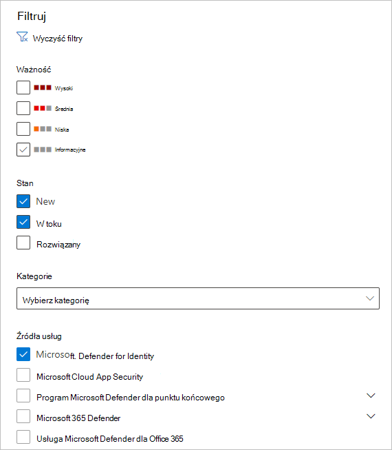

# Alerty zabezpieczeń usługi Defender dla tożsamości w aplikacji Microsoft 365 Defender

**Dotyczy:**

- Microsoft 365 Defender
- Defender for Identity

W tym artykule wyjaśniono podstawy pracy z alertami zabezpieczeń usługi [Microsoft Defender dla tożsamości](/defender-for-identity) w [programie Microsoft 365 Defender](/microsoft-365/security/defender/overview-security-center).

Alerty usługi Defender dla tożsamości są natywnie zintegrowane <a href="https://go.microsoft.com/fwlink/p/?linkid=2077139" target="_blank">Microsoft 365 Defender</a> z dedykowanym formatem strony alertów tożsamości. Jest to pierwszy krok w kierunku wprowadzenia pełnego programu [Microsoft Defender dla tożsamości](/defender-for-identity/defender-for-identity-in-microsoft-365-defender) do programu Microsoft 365 Defender.

Strona nowego alertu tożsamości zapewnia programowi Microsoft Defender dla klientów tożsamości lepsze wzbogacenie sygnału między domenami oraz nowe automatyczne funkcje odpowiedzi tożsamości. Zapewnia bezpieczeństwo i pomaga zwiększyć wydajność operacji zabezpieczających.

Jedną z zalet badania alertów za pośrednictwem programu [Microsoft 365 Defender](/microsoft-365/security/defender/microsoft-365-defender) jest to, że alerty usługi Microsoft Defender dla tożsamości są bardziej skorelowane z informacjami uzyskanymi z każdego z pozostałych produktów w pakiecie. Te rozszerzone alerty są spójne z innymi formatami alertów programu Microsoft 365 Defender programu [Microsoft Defender](/microsoft-365/security/office-365-security) dla programu Office 365 oraz [z programem Microsoft Defender for Endpoint](/microsoft-365/security/defender-endpoint). Nowa strona w praktyce eliminuje konieczność przechodzenia do innego portalu produktu w celu zbadania alertów skojarzonych z tożsamością.

Alerty pochodzące z usługi Defender dla tożsamości mogą teraz uruchamiać funkcje automatycznego badania i odpowiedzi [(AIR) programu Microsoft 365 Defender, w](/microsoft-365/security/defender/m365d-autoir) tym automatyczne korygowanie alertów oraz ograniczanie narzędzi i procesów, które mogą przyczyniać się do podejrzanych działań.

> [!IMPORTANT]
> W ramach schłodowania w Microsoft 365 Defender tożsamości niektóre opcje i szczegóły zmieniły się od ich lokalizacji w portalu usługi Defender dla tożsamości. Zapoznaj się ze szczegółami poniżej, aby dowiedzieć się, gdzie znaleźć zarówno znane, jak i nowe funkcje.

## Przeglądanie alertów zabezpieczeń

Dostęp do alertów można uzyskiwać z wielu lokalizacji, w tym ze strony  Alerty, ze strony Zdarzenia, ze stron poszczególnych urządzeń oraz ze  strony zaawansowanego wyszukiwania. W tym przykładzie przejdę stronę **Alerty**.

W <a href="https://go.microsoft.com/fwlink/p/?linkid=2077139" target="_blank">Microsoft 365 Defender</a> przejdź do alertów w & **zdarzeniach**, a następnie do **alertów**.

Aby wyświetlić alerty z usługi Defender for Identity, w prawym górnym rogu wybierz pozycję **Filtr**, a  następnie w obszarze Źródła usług wybierz pozycję **Microsoft Defender for Identity** i wybierz pozycję **Zastosuj**:

Alerty są wyświetlane z informacjami w następujących kolumnach: Nazwa **alertu****, Tagi****,** Ważność **, Stan** badania, **Stan****, Kategoria****, Źródło** wykrywania **, Zasoby****, Pierwsze** działanie i **Ostatnie działanie**.

## Zarządzanie alertami

Jeśli klikniesz **nazwę alertu** dla jednego z alertów, zostaniesz na stronie ze szczegółami alertu. W okienku po lewej stronie zobaczysz podsumowanie Co się **stało**:

Powyżej pola **Co się stało** znajdują przyciski **Konta**, **Host docelowy** **i Host** źródłowy alertu. W przypadku innych alertów mogą być dostępne przyciski służące do szczegółowych informacji o dodatkowych hostach, kontach, adresach IP, domenach i grupach zabezpieczeń. Wybierz dowolną z nich, aby uzyskać więcej szczegółowych informacji na temat zaangażowanych jednostek.

W prawym okienku zobaczysz szczegóły **alertu**. W tym miejscu można wyświetlić więcej szczegółów i wykonać kilka zadań:

- **Klasyfikowanie tego alertu** — w tym miejscu możesz określić ten alert jako **alert Prawda lub** Jako **fałszywy**

    

- **Stan alertu** — w **koncentracji klasyfikacji** możesz sklasyfikować alert jako **Prawda** lub **Fałsz**. W **onecie** Przypisano możesz przypisać alert do siebie lub go nieprzydzielić.

    

-  Szczegóły alertu — w obszarze Szczegóły alertu możesz znaleźć więcej informacji na temat konkretnego alertu, śledzić link do dokumentacji dotyczącej typu alertu, sprawdzać, z którym zdarzeniem jest skojarzony alert, przeglądać wszystkie zautomatyzowane badania połączone z tym typem alertu, a także sprawdzać urządzenia i użytkowników, których to dotyczy.

    

- **Komentarze & —** tutaj możesz dodawać komentarze do alertu i wyświetlić historię wszystkich akcji skojarzonych z alertem.

    

- **Zarządzanie alertami** — jeśli wybierzesz pozycję **Zarządzaj alertem**, przejdź do okienka umożliwiającego edytowanie:
  - **Stan** — możesz wybrać pozycję **Nowy**, **Rozwiązany** **lub W toku**.
  - **Klasyfikacja** — możesz wybrać pozycję **Prawda alertu** **lub Alert o wartości Fałsz**.
  - **Komentarz** — możesz dodać komentarz na temat alertu.

    Jeśli wybierzesz trzy kropki obok przycisku Zarządzaj **alertem**, możesz skorzystać z opcji Skonsultuj się z ekspertem ds.  **zagrożeń,** Wyeksportuj alert do pliku Excel pliku lub **Link do innego zdarzenia**.

    

    > [!NOTE]
    > W pliku Excel teraz dostępne są dwa linki: Wyświetl w programie **Microsoft Defender dla tożsamości** i **Wyświetl w programie Microsoft 365 Defender**. Każdy link prowadzi do odpowiedniego portalu i zawiera informacje o alercie.

## Zobacz też

- [Badanie alertów w programie Microsoft 365 Defender](../defender/investigate-alerts.md)
