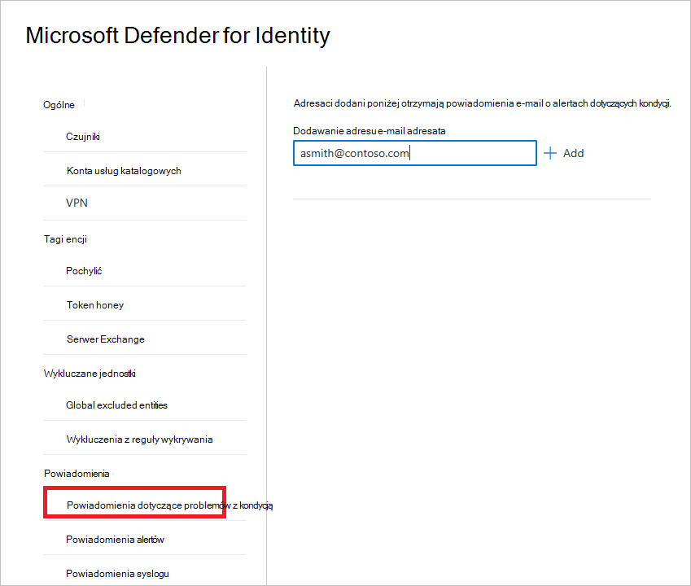
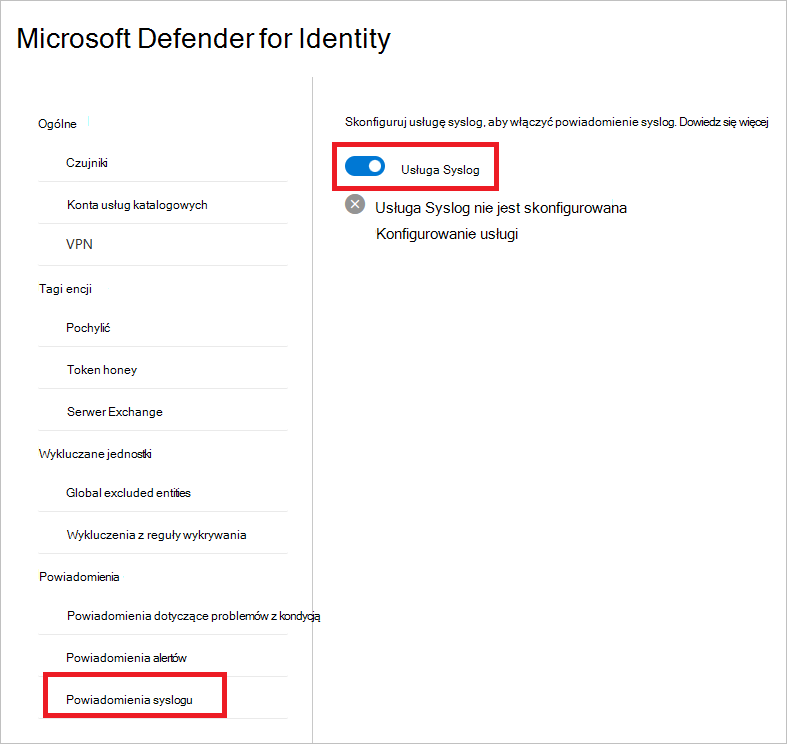
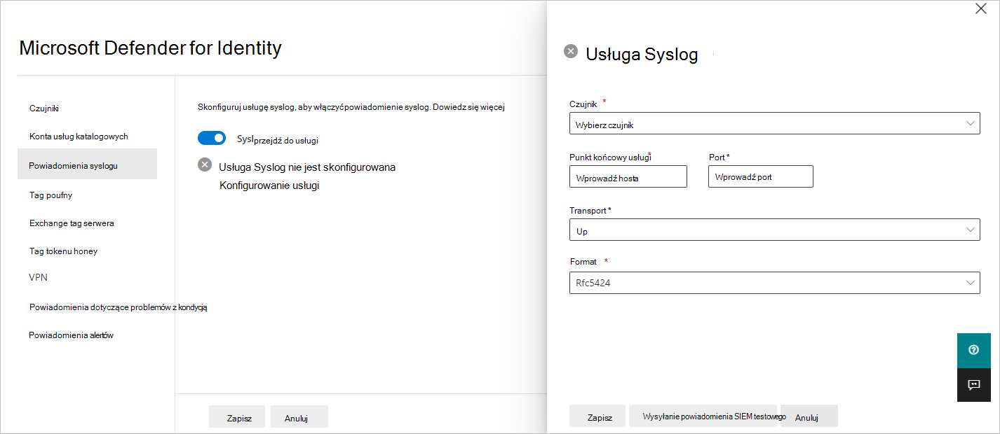
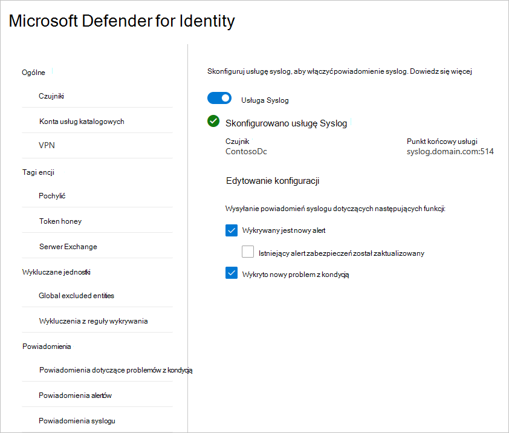

# Powiadomienia usługi Defender dla tożsamości w programie Microsoft 365 Defender

**Dotyczy:**

- Microsoft 365 Defender
- Defender for Identity

W tym artykule wyjaśniono, jak pracować z powiadomieniami usługi [Microsoft Defender dla](/defender-for-identity) tożsamości w aplikacji [Microsoft 365 Defender](/microsoft-365/security/defender/overview-security-center).

> [!IMPORTANT]
> W ramach schłodowania w Microsoft 365 Defender tożsamości niektóre opcje i szczegóły zmieniły się od ich lokalizacji w portalu usługi Defender dla tożsamości. Zapoznaj się ze szczegółami poniżej, aby dowiedzieć się, gdzie znaleźć zarówno znane, jak i nowe funkcje.

## Powiadomienia dotyczące problemów z kondycją

W Microsoft 365 Defender usługi Defender dla tożsamości możesz dodać adresatów wiadomości e-mail z powiadomieniami o problemach dotyczących kondycji.

1. Na <a href="https://go.microsoft.com/fwlink/p/?linkid=2077139" target="_blank">Microsoft 365 Defender</a> **przejdź do Ustawienia** i **Tożsamości**.

    

1. Wybierz pozycję **Powiadomienia o problemach z kondycją**.

1. Wprowadź adres e-mail adresata. Wybierz opcję **Dodaj**.

    

1. Gdy program Defender dla tożsamości wykryje problem z kondycją, adresaci otrzymają wiadomość e-mail z powiadomieniem o szczegółach.

    

    > [!NOTE]
    > Wiadomość e-mail zawiera dwa linki do szczegółowych informacji o problemie. Możesz przejść do Centrum **kondycji MDI** lub nowego centrum **kondycji w uściślicie M365D**.

## Powiadomienia alertów

W Microsoft 365 Defender możesz dodać adresatów do powiadomień e-mail o wykrytych alertach.

1. Na <a href="https://go.microsoft.com/fwlink/p/?linkid=2077139" target="_blank">Microsoft 365 Defender</a> **przejdź do Ustawienia** i **Tożsamości**.

    

1. Wybierz pozycję **Powiadomienia alertów**.

1. Wprowadź adres e-mail adresata. Wybierz opcję **Dodaj**.

    

## Powiadomienia syslogu

Program Defender for Identity może powiadamiać Cię o wykryciu podejrzanych działań, wysyłając alerty o zabezpieczeniach i kondycji do serwera syslogów za pośrednictwem nominowego czujnika.

> [!NOTE]
> Aby dowiedzieć się, jak zintegrować usługę Defender for Identity z programem Microsoft Sentinel, zobacz Microsoft 365 Defender [integracji z programem Microsoft Sentinel](/azure/sentinel/microsoft-365-defender-sentinel-integration).

1. Na <a href="https://go.microsoft.com/fwlink/p/?linkid=2077139" target="_blank">Microsoft 365 Defender</a> **przejdź do Ustawienia** i **Tożsamości**.

    

1. Wybierz **pozycję Powiadomienia syslogu**.

1. Aby włączyć powiadomienie systemu, ustaw przełącznik usługi **Syslog** w pozycji " **wł** ".

    

1. Wybierz **pozycję Konfiguruj usługę**. Zostanie otwarte okienko, w którym możesz wprowadzić szczegóły usługi syslog.

    

1. Wprowadź następujące szczegóły:

    - **Czujnik** — z listy rozwijanej wybierz czujnik, który będzie wysyłał alerty.
    - **Punkt końcowy** usługi **i port** — wprowadź adres IP lub w pełni kwalifikowaną nazwę domeny (FQDN) dla serwera syslog i podaj numer portu. Możesz skonfigurować tylko jeden punkt końcowy systemu Syslog.
    - **Transport** — wybierz **protokół Transport** (TCP lub UDP).
    - **Format** — wybierz format (RFC 3164 lub RFC 5424).

1. Wybierz **pozycję Wyślij powiadomienie SIEM testu** , a następnie sprawdź, czy wiadomość została odebrana w rozwiązaniu infrastruktury systemu Syslog.

1. Wybierz **Zapisz**.

1. Po skonfigurowaniu usługi **Syslog** możesz wybrać typy powiadomień (alertów i problemów dotyczących kondycji) do wysyłania do serwera syslogu.

    

## Zobacz też

- [Zarządzanie alertami zabezpieczeń usługi Defender for Identity](manage-security-alerts.md)
