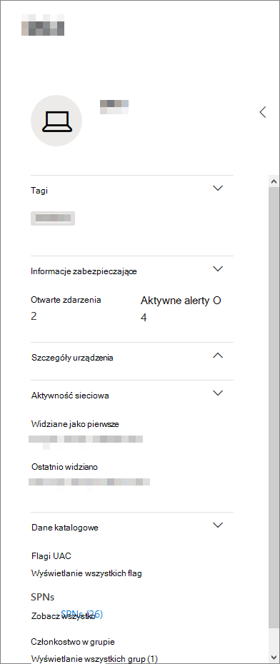
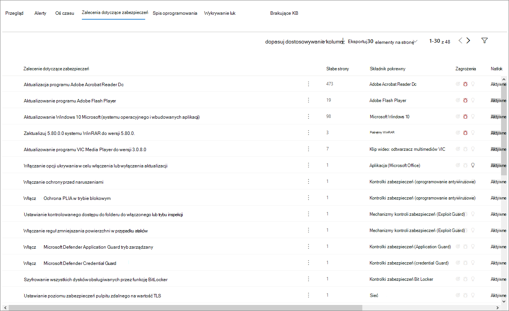
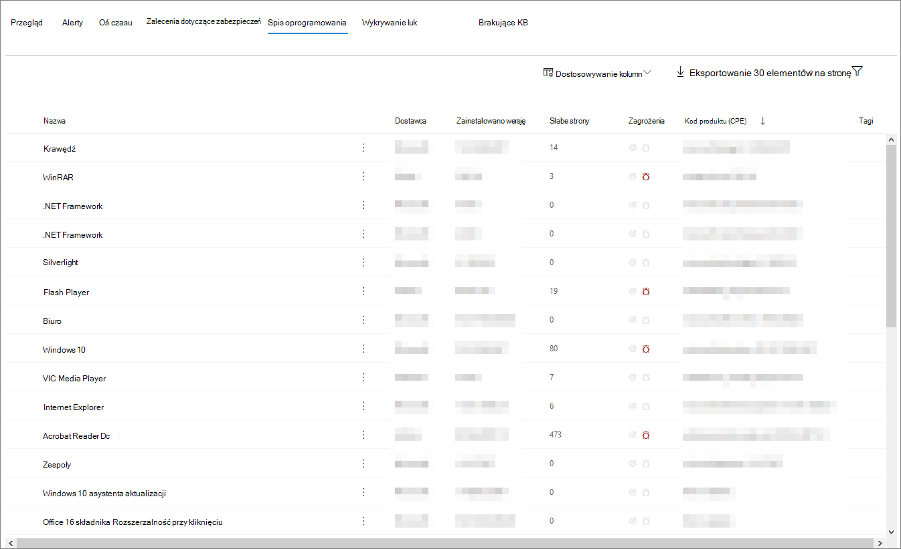

# Strona profilu urządzenia

[!INCLUDE [Microsoft 365 Defender rebranding](../includes/microsoft-defender.md)]

Portal Microsoft 365 zabezpieczeń udostępnia strony profilów urządzeń, dzięki czemu możesz szybko ocenić kondycję i stan urządzeń w swojej sieci.

> [!IMPORTANT]
> Strona profilu urządzenia może wyglądać nieco inaczej w zależności od tego, czy urządzenie zostało zarejestrowane w programie Microsoft Defender for Endpoint, Microsoft Defender for Identity, czy w obu tych usługach.

Jeśli urządzenie jest zarejestrowane w usłudze Microsoft Defender for Endpoint, możesz również użyć strony profilu urządzenia, aby wykonać niektóre typowe zadania związane z zabezpieczeniami.

## Nawigowanie po stronie profilu urządzenia

Strona profilu jest podzielone na kilka szerokich sekcji.

Pasek boczny (1) zawiera podstawowe informacje o urządzeniu.

Główny obszar zawartości (2) zawiera karty, które można przełączać, aby wyświetlać różne rodzaje informacji o urządzeniu.

Jeśli urządzenie jest zarejestrowane w usłudze Microsoft Defender for Endpoint, zobaczysz również listę akcji odpowiedzi (3). Akcje odpowiedzi umożliwiają wykonywanie typowych zadań związanych z zabezpieczeniami.

## Pasek boczny

Obok głównego obszaru zawartości strony profilu urządzenia znajduje się pasek boczny.

Pasek boczny zawiera pełną nazwę urządzenia i poziom ekspozycji. W małych podsekcjach przedstawiono również niektóre ważne podstawowe informacje, które można włączać i zamykać, na przykład:

* **Tagi** — dowolna usługa Microsoft Defender dla punktu końcowego, usługa Microsoft Defender dla tożsamości lub niestandardowe tagi skojarzone z urządzeniem. Tagów z usługi Microsoft Defender for Identity nie można edytować.
* **Informacje zabezpieczające** — otwarte zdarzenia i aktywne alerty. Urządzenia zarejestrowane w usłudze Microsoft Defender for Endpoint będą również wyświetlać poziom ekspozycji i poziom ryzyka.

> [!TIP]
> Poziom ekspozycji jest związany z tym, ile urządzenie przestrzega zaleceń dotyczących zabezpieczeń, natomiast poziom ryzyka jest obliczany na podstawie liczby czynników, w tym typów i ważności aktywnych alertów.

* **Szczegóły urządzenia** — domena, system operacyjny, sygnatura czasowa dla pierwszego widzianego urządzenia, adresy IP, zasoby. Urządzenia zarejestrowane w usłudze Microsoft Defender for Endpoint także wyświetlają stan kondycji. Urządzenia zarejestrowane w usłudze Microsoft Defender for Identity będą wyświetlać nazwę SAM i sygnaturę czasową dla pierwszego utworzenia urządzenia.
* **Aktywność sieciowa** — sygnatury czasowe po raz pierwszy i ostatni raz, gdy urządzenie było widziane w sieci.
* **Dane katalogowe** (*tylko dla urządzeń zarejestrowanych w usłudze Microsoft Defender dla* tożsamości) — [flagi UAC](/windows/security/identity-protection/user-account-control/user-account-control-overview) , sieci [SPN](/windows/win32/ad/service-principal-names) i członkostwa w grupach.

## Akcje odpowiedzi

Akcje reagowania to szybki sposób obrony przed zagrożeniami i analizowania ich.

> [!IMPORTANT]
> * [Akcje odpowiedzi](/windows/security/threat-protection/microsoft-defender-atp/respond-machine-alerts) są dostępne tylko wtedy, gdy urządzenie jest zarejestrowane w programie Microsoft Defender for Endpoint.
> * Urządzenia zarejestrowane w usłudze Microsoft Defender for Endpoint mogą wyświetlać różne liczby akcji odpowiedzi w zależności od systemu operacyjnego i numeru wersji urządzenia.

Na stronie profilu urządzenia dostępne są między innymi następujące akcje:

* **Zarządzanie tagami** — aktualizuje tagi niestandardowe zastosowane do tego urządzenia.
* **Urządzenie wyizoluj** — wyodrębnia urządzenie z sieci organizacji przy zachowaniu połączenia z usługą Microsoft Defender for Endpoint. Możesz zezwolić na uruchamianie Outlook, Teams i Skype dla firm, gdy urządzenie jest odizolowane, na potrzeby komunikacji.
* **Centrum akcji** — wyświetlanie stanu przesłanych akcji. Dostępne tylko, jeśli została już wybrana inna akcja.
* **Ogranicz wykonywanie aplikacji —** zapobiega uruchamianiu aplikacji, które nie są podpisane przez firmę Microsoft.
* **Uruchom skanowanie antywirusowe** — aktualizacje Program antywirusowy Windows Defender i natychmiast uruchamia skanowanie antywirusowe. Wybierz opcję Szybkie skanowanie lub Pełne skanowanie.
* **Zbierz pakiet badania** — zbiera informacje o urządzeniu. Po zakończeniu badania możesz go pobrać.
* **Inicjowanie sesji odpowiedzi na żywo** — ładuje powłokę zdalną na urządzeniu w celu [dogłębnego badania zabezpieczeń](/microsoft-365/security/defender-endpoint/live-response).
* **Inicjowanie automatycznego badania** — automatyczne [badanie i korygowanie zagrożeń](../office-365-security/office-365-air.md). Mimo że z tej strony można ręcznie wyzwolić automatyczne badania, niektóre [zasady alertów](../../compliance/alert-policies.md#default-alert-policies) samodzielnie powodują uruchomienie automatycznego badania.
* **Centrum akcji** — wyświetla informacje o wszystkich obecnie uruchomionych akcjach odpowiedzi.

## Sekcja Tabulatory

Karty profilów urządzeń umożliwiają przełączanie się między omówieniem szczegółów zabezpieczeń urządzenia i tabel zawierających listę alertów.

Urządzenia zarejestrowane w usłudze Microsoft Defender for Endpoint będą również wyświetlać karty, które oferują oś czasu, listę zaleceń dotyczących zabezpieczeń, spis oprogramowania, listę wykrytych luk i brakujące kb/kb (aktualizacje zabezpieczeń).

### Karta Omówienie

Karta domyślna to **Przegląd**. Zapewnia ona krótki przegląd najważniejszych informacji dotyczących zabezpieczeń urządzenia.

W tym miejscu możesz szybko sprawdzić aktywne alerty urządzenia i wszystkich obecnie zalogowanych użytkowników.

Jeśli urządzenie jest zarejestrowane w usłudze Microsoft Defender for Endpoint, będzie również wyświetlony poziom ryzyka urządzenia i wszelkie dostępne dane na temat oceny zabezpieczeń. Oceny zabezpieczeń opisują poziom ochrony urządzenia, zapewniają zalecenia dotyczące zabezpieczeń oraz listy programów, których to dotyczy, oraz wykryją luki w zabezpieczeniach.

### Karta Alerty

Karta **Alerty** zawiera listę alertów, które zostały podniesione na urządzeniu, zarówno z programu Microsoft Defender for Identity, jak i z programu Microsoft Defender for Endpoint.

Możesz dostosować liczbę wyświetlanych elementów oraz kolumny wyświetlane dla poszczególnych elementów. Domyślnym zachowaniem jest lista trzydziestu elementów na stronie.

Kolumny na tej karcie zawierają informacje o powagi zagrożenia, które wyzwoliło alert, a także o stanie, stanie badania i tym, komu alert został przypisany.

Kolumna *jednostek,* których dotyczy problem, odwołuje się do urządzenia (jednostki), którego profil obecnie wyświetlasz, oraz wszelkich innych urządzeń w Twojej sieci, których dotyczy problem.

Wybranie elementu z tej listy spowoduje otwarcie wysuwu zawierającego jeszcze więcej informacji o wybranym alercie.

Tę listę można filtrować według ważności, stanu lub osoby, do których przypisano alert.

### Karta Oś czasu

Karta **Oś** czasu zawiera interakcyjny, chronologiczny wykres wszystkich zdarzeń podniesionych na urządzeniu. Przesuwając wyróżniony obszar wykresu w lewo lub w prawo, można wyświetlać zdarzenia w różnych okresach czasu. Możesz również wybrać niestandardowy zakres dat z menu rozwijanego między interakcyjny wykres a listą zdarzeń.

Poniżej wykresu znajduje się lista zdarzeń dla wybranego zakresu dat.

Liczbę wyświetlanych elementów i kolumn na liście można dostosować. Kolumny domyślne zawierają listę czasu zdarzenia, aktywnego użytkownika, typu akcji, jednostek (procesów) i dodatkowych informacji o zdarzeniu.

Wybranie elementu z tej listy spowoduje otwarcie wysuwanego menu z wyświetlonym wykresem jednostek zdarzenia, przedstawiającym procesy nadrzędne i podrzędne uczestniczące w zdarzeniu.

Listę można filtrować według określonego rodzaju zdarzenia. na przykład zdarzenia rejestru lub zdarzenia ekranu inteligentnego.

Listę można również wyeksportować do pliku CSV, aby można ją było pobrać. Mimo że plik nie jest ograniczony liczbą zdarzeń, maksymalny zakres czasu, jaki można wybrać do wyeksportowania, wynosi siedem dni.

### Karta Zalecenia dotyczące zabezpieczeń

Karta **Zalecenia dotyczące** zabezpieczeń zawiera listę akcji, które można podjąć w celu ochrony urządzenia. Wybranie elementu na tej liście spowoduje otwarcie wysuwu, w którym możesz uzyskać instrukcje dotyczące stosowania zalecenia.

Podobnie jak w przypadku poprzednich kart można dostosować liczbę wyświetlanych elementów na stronie oraz kolumny, które są widoczne.

Widok domyślny zawiera kolumny ze szczegółami problemami zabezpieczeń, powiązanym z nim zagrożeniem, powiązanym składnikiem lub oprogramowaniem, którego dotyczy zagrożenie, i nie tylko. Elementy można filtrować według stanu zalecenia.

### Spis oprogramowania

Karta **Spis oprogramowania** zawiera listę oprogramowania zainstalowanego na urządzeniu.

W widoku domyślnym jest wyświetlany dostawca oprogramowania, numer zainstalowanej wersji, liczba znanych użytkowników oprogramowania, szczegółowe informacje o zagrożeniach, kod produktu i tagi. Liczbę wyświetlanych elementów i wyświetlane kolumny można dostosować.

Wybranie elementu z tej listy powoduje otwarcie wysuwu zawierającego więcej szczegółowych informacji na temat wybranego oprogramowania, a także ścieżki i sygnatury czasowej po ostatnim odnalezioniu oprogramowania.

Tę listę można filtrować według kodu produktu.

### Karta Wykryj luki

Karta **Wykryj luki w** zabezpieczeniach zawiera listę typowych luk i luk w zabezpieczeniach (CVE), które mogą mieć wpływ na urządzenie.

Widok domyślny zawiera listę ważności CVE, wspólnego wyniku luk, oprogramowania związanego z oknem cve, opublikowania życiorysu i ostatniej aktualizacji tego poziomu oraz zagrożeń związanych z oknem cvE.

Podobnie jak w przypadku poprzednich kart można dostosować liczbę wyświetlanych elementów i widoczne kolumny.

Wybranie elementu z tej listy spowoduje otwarcie wysuwu z opisem życiorysu.

### Brakujące KB

Karta **Brakujące kb/kb zawiera** listę wszystkich aktualizacji firmy Microsoft, które jeszcze nie zostały zastosowane do urządzenia. Dane "KB" to artykuły z bazy wiedzy [,](https://support.microsoft.com/help/242450/how-to-query-the-microsoft-knowledge-base-by-using-keywords-and-query) w których opisano te aktualizacje. na przykład [KB4551762](https://support.microsoft.com/help/4551762/windows-10-update-kb4551762).

Widok domyślny zawiera biuletyn zawierający aktualizacje, wersję systemu operacyjnego, produkty, których dotyczy problem, życiorysy, numer KB i tagi.

Można dostosować liczbę wyświetlanych elementów na stronie oraz kolumny.

Wybranie elementu spowoduje otwarcie wysuwu linku do aktualizacji.

## Tematy pokrewne

* [Microsoft 365 Defender omówienie](microsoft-365-defender.md)
* [Włączanie Microsoft 365 Defender](m365d-enable.md)
* [Badanie jednostek na urządzeniach przy użyciu funkcji odpowiedzi na żywo](../defender-endpoint/live-response.md)
* [Zautomatyzowane badania i odpowiedzi (AIR) w programie Office 365](../office-365-security/office-365-air.md)
