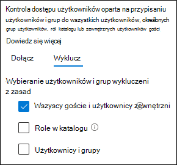

# Zasady zezwalania na dostęp gości i dostęp użytkownika zewnętrznego B2B

W tym artykule omówiono dostosowywanie zalecanych zasad dostępu do urządzeń i tożsamości zerowego zaufania w celu umożliwienia dostępu gościom i użytkownikom zewnętrznym, którzy mają konto usługi Azure Active Directory (Azure AD) między firmami (B2B). Te wskazówki są opierane na [wspólnych zasadach dostępu do tożsamości i urządzeń](identity-access-policies.md).

Zalecenia te są przeznaczone do stosowania **do warstwy ochrony** punktu początkowego. Możesz jednak dostosować zalecenia do konkretnych potrzeb w przypadku **przedsiębiorstwa i** **specjalistycznej ochrony** zabezpieczeń.

Udostępnienie ścieżki uwierzytelniania kont B2B w dzierżawie usługi Azure AD nie zapewnia tych kont dostępu do całego środowiska. Użytkownicy B2B i ich konta mają dostęp do usług i zasobów, takich jak pliki, udostępnianych im przez zasady dostępu warunkowego.

## Aktualizowanie typowych zasad w celu umożliwienia i ochrony gości oraz dostępu użytkowników zewnętrznych

Na tym diagramie pokazano zasady, które należy dodać lub zaktualizować wśród wspólnych zasad dostępu do tożsamości i urządzeń w zakresie dostępu gościa i użytkownika zewnętrznego B2B.

:::image type="content" source="../../media/microsoft-365-policies-configurations/identity-access-ruleset-guest.png" alt-text="Podsumowanie aktualizacji zasad w celu ochrony dostępu gościa." lightbox="../../media/microsoft-365-policies-configurations/identity-access-ruleset-guest.png":::

W poniższej tabeli wymieniono zasady, które należy utworzyć i zaktualizować. Typowe zasady są linkiem do skojarzonych instrukcji konfiguracji podanych w [artykule Typowe zasady](identity-access-policies.md) dostępu do urządzeń i tożsamości.

|Poziom ochrony|Policies (zasady)|Więcej informacji|
|---|---|---|
|**Punkt początkowy**|[Wymaganie uwierzytelniania wieloskładnikowego zawsze w przypadku gości i użytkowników zewnętrznych](identity-access-policies.md#require-mfa-based-on-sign-in-risk)|Utwórz nowe zasady i skonfiguruj je: <ul><li>W **przypadku zadań > Użytkownicy i grupy > Dołącz**, wybierz pozycję Wybierz użytkowników i **grupy, a** następnie wybierz **pozycję Wszyscy goście i użytkownicy zewnętrzni**.</li><li>W **przypadku > warunki >** logowania pozostaw dla wszystkich opcji wyczyszczone pole wyboru, aby zawsze wymuszać uwierzytelnianie wieloskładnikowe (MFA).</li></ul>|
||[Wymagaj uwierzytelniania wieloskładnikowego, gdy ryzyko logowania *jest średnie* lub *wysokie*](identity-access-policies.md#require-mfa-based-on-sign-in-risk)|Zmodyfikuj te zasady, aby wykluczyć gości i użytkowników zewnętrznych.|

Aby uwzględnić lub wykluczyć gości i użytkowników zewnętrznych w zasadach dostępu warunkowego, w przypadku zadań w grupie > Użytkownicy i grupy **>** Dołącz lub Wyklucz **zaznacz pole** wyboru Wszyscy goście i **użytkownicy zewnętrzni**.

## Więcej informacji

### Dostęp gości i użytkowników zewnętrznych za pomocą aplikacji Microsoft Teams

Microsoft Teams definiuje następujących użytkowników:

- **Dostęp gościa** korzysta z konta B2B usługi Azure AD, które można dodać jako członka zespołu i mieć dostęp do komunikacji i zasobów zespołu.

- **Dostęp zewnętrzny** jest dla użytkownika zewnętrznego, który nie ma konta B2B. Dostęp użytkowników zewnętrznych obejmuje zaproszenia, połączenia, czaty i spotkania, ale nie obejmuje członkostwa w zespole i dostępu do zasobów zespołu.

Aby uzyskać więcej informacji, zobacz [porównanie gości i dostępu użytkowników zewnętrznych dla zespołów](/microsoftteams/communicate-with-users-from-other-organizations#compare-external-and-guest-access).

Aby uzyskać więcej informacji na temat zabezpieczania zasad dostępu do urządzeń i tożsamości na Teams, zobacz Zalecenia dotyczące zasad dotyczące Teams czatów[, grup i plików](teams-access-policies.md).

### Wymaganie uwierzytelniania wieloskładnikowego zawsze w przypadku gości i użytkowników zewnętrznych

Te zasady monitują gości o zarejestrowanie uwierzytelniania MFA w dzierżawie, niezależnie od tego, czy są zarejestrowani w celu uwierzytelniania MFA w dzierżawie głównej. Podczas uzyskiwania dostępu do zasobów w dzierżawie goście i użytkownicy zewnętrzni muszą używać uwierzytelniania MFA dla każdego żądania.

### Wykluczanie gości i użytkowników zewnętrznych z uwierzytelniania wieloskładnikowego opartego na czynnikach ryzyka

Mimo że organizacje mogą wymuszać zasady oparte na czynnikach ryzyka dla użytkowników B2B przy użyciu usługi Azure AD Identity Protection, istnieją ograniczenia implementacji usługi Azure AD Identity Protection dla użytkowników współpracy B2B w katalogu zasobów ze względu na swoją tożsamość istniejącą w ich katalogu macierzystym. Z powodu tych ograniczeń firma Microsoft zaleca wykluczenie gości z zasad uwierzytelniania wieloskładnikowego opartych na czynnikach ryzyka i wymaganie, aby ci użytkownicy zawsze korzystali z uwierzytelniania wieloskładnikowego.

Aby uzyskać więcej informacji, zobacz [Ograniczenia ochrony tożsamości dla użytkowników współpracy B2B](/azure/active-directory/identity-protection/concept-identity-protection-b2b#limitations-of-identity-protection-for-b2b-collaboration-users).

### Wykluczanie gości i użytkowników zewnętrznych z zarządzania urządzeniami

Tylko jedna organizacja może zarządzać urządzeniem. Jeśli nie wykluczasz gości i użytkowników zewnętrznych z zasad wymagających zgodności urządzeń, te zasady będą blokować tych użytkowników.

## Następny krok

Skonfiguruj zasady dostępu warunkowego dla:

- [Microsoft Teams](teams-access-policies.md)
- [Exchange Online](secure-email-recommended-policies.md)
- [SharePoint](sharepoint-file-access-policies.md)
- [Usługa Microsoft Defender dla aplikacji w chmurze](mcas-saas-access-policies.md)
 
