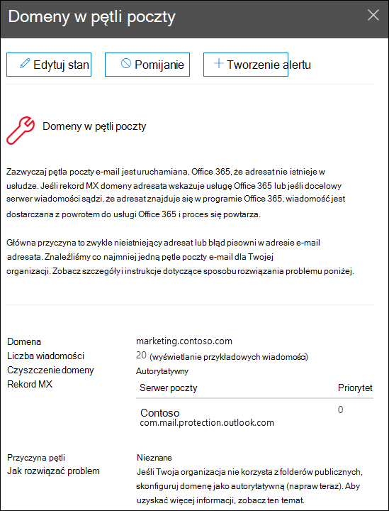

# Naprawianie ewentualnych informacji dotyczących pętli poczty w Centrum & zgodności

[!INCLUDE [Microsoft 365 Defender rebranding](../includes/microsoft-defender-for-office.md)]

**Dotyczy**
- [Exchange Online Protection](exchange-online-protection-overview.md)
- [Microsoft Defender dla Office 365 plan 1 i plan 2](defender-for-office-365.md)
- [Microsoft 365 Defender](../defender/microsoft-365-defender.md)

Pętle poczty są złe, ponieważ:

- Marnują one zasoby systemowe.
- Zużyje one przydział poczty e-mail Twojej organizacji.
- Wysyłają one do oryginalnych nadawców mylące raporty o niedo dostarczenia (nazywane też raportami o niedo dostarczenia lub wiadomościami odsuwanymi).

W **obszarze** Polecane dla Ciebie na pulpicie nawigacyjnym przepływu poczty  w Centrum zabezpieczeń & zgodności  w Centrum zabezpieczeń i zgodności jest powiadamiany o wykryciu pętli poczty w organizacji.

Ta informacja pojawia się tylko po wykryciu warunku (jeśli nie masz żadnych pętli poczty, nie zobaczysz tej informacji).

Po kliknięciu w **widżecie** przycisku Wyświetl szczegóły zostanie wyświetlone wysuwne okno z większej liczby informacji:

- **Domain (Domena)**
- **Liczba wiadomości**: Możesz kliknąć pozycję **Wyświetl** przykładowe wiadomości, aby wyświetlić  wyniki śledzenia wiadomości dla przykładowych wiadomości, których dotyczyła pętla.
- **Typ domeny**" Na przykład Autorytatywny lub Nie autorytatywny.
- **Rekord MX**: wartości hosta (**serwera poczty**) i **priorytetu** rekordu MX domeny.
- **Przyczyna pętli** **i sposób rozwiązania**: Określimy najbardziej typowe scenariusze pętli poczty i udostępnimy zalecane akcje naprawiania pętli.

## Zobacz też

Aby uzyskać więcej informacji na temat pulpitu nawigacyjnego przepływu poczty e-mail, zobacz Szczegółowe informacje o przepływie poczty w [Centrum & zabezpieczeń i zgodności](mail-flow-insights-v2.md).
