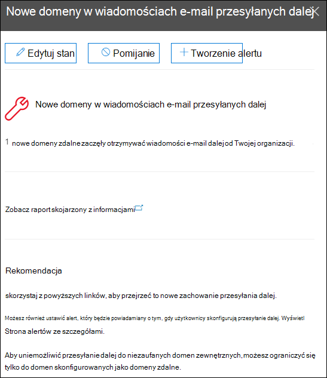

# Informacje o nowych domenach przesyłanych dalej w Centrum & zabezpieczeń i zgodności

[!INCLUDE [Microsoft 365 Defender rebranding](../includes/microsoft-defender-for-office.md)]

**Dotyczy**
- [Exchange Online Protection](exchange-online-protection-overview.md)
- [Microsoft Defender dla Office 365 plan 1 i plan 2](defender-for-office-365.md)
- [Microsoft 365 Defender](../defender/microsoft-365-defender.md)

Istnieją ważne powody biznesowe, dla których wiadomości e-mail mogą być przesyłane dalej do adresatów zewnętrznych w określonych domenach. Jest to jednak podejrzane, gdy użytkownicy w Twojej organizacji nagle zaczną przesyłać dalej wiadomości do domeny, do której żadna z osób w organizacji nie przesyłała dalej wiadomości (do nowej domeny).

Ten warunek może wskazywać, że konta użytkowników zostały naruszone. Jeśli podejrzewasz, że konta zostały naruszone, zobacz Odpowiadanie na [naruszone konto e-mail](responding-to-a-compromised-email-account.md).

Szczegółowe **informacje o nowych domenach** w Centrum [&](https://protection.office.com) zabezpieczeń i zgodności powiadomią Cię, gdy użytkownicy w Twojej organizacji będą przesyłać dalej wiadomości do nowych domen.

Ta informacja jest widoczna tylko po wykryciu problemu i pojawia się na stronie [Raport przesyłany](view-mail-flow-reports.md#forwarding-report) dalej.

Po kliknięciu widżetu zostanie wyświetlone wysuwne okno, w którym można znaleźć więcej szczegółowych informacji na temat wiadomości przesyłanych dalej, w tym link do raportu [przesyłania dalej](view-mail-flow-reports.md#forwarding-report).

Możesz również przejść do tej strony szczegółów, gdy wybierzesz szczegółowe informacje po kliknięciu przycisku Wyświetl wszystkie w obszarze Najważniejsze informacje **& zalecenia** na (**Pulpit** \> nawigacyjny **Raporty** lub <https://protection.office.com/insightdashboard>).

Aby zapobiec automatycznemu przesyłaniu wiadomości do domen zewnętrznych, skonfiguruj domenę zdalną dla niektórych lub wszystkich domen zewnętrznych. Aby uzyskać więcej informacji, zobacz [Zarządzanie domenami zdalnymi w Exchange Online](/Exchange/mail-flow-best-practices/remote-domains/manage-remote-domains).

## Tematy pokrewne

Aby uzyskać więcej informacji na temat pulpitu nawigacyjnego przepływu poczty e-mail, zobacz Szczegółowe informacje o przepływie poczty w [Centrum & zabezpieczeń i zgodności](mail-flow-insights-v2.md).