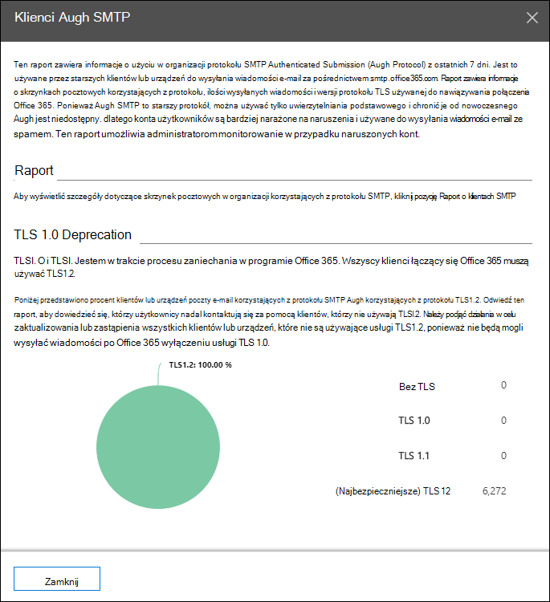

# Szczegółowe informacje o klientach uwierzytelniania SMTP i raport w Centrum & zgodności

[!INCLUDE [Microsoft 365 Defender rebranding](../includes/microsoft-defender-for-office.md)]

**Dotyczy**
- [Exchange Online Protection](exchange-online-protection-overview.md)
- [Microsoft Defender dla Office 365 plan 1 i plan 2](defender-for-office-365.md)
- [Microsoft 365 Defender](../defender/microsoft-365-defender.md)

Szczegółowe informacje dotyczące klientów **usługi SMTP Auth** na  pulpicie nawigacyjnym przepływu poczty i skojarzonym z nim raportem Klienci uwierzytelniania [SMTP](#smtp-auth-clients-report) w Centrum zgodności [usługi Zabezpieczenia &](https://protection.office.com) wyróżnieniem użycia protokołu przesyłania klienta SMTP AUTH przez użytkowników lub konta systemowe w organizacji. Ten starszy protokół (który używa parametru smtp.office365.com) oferuje tylko uwierzytelnianie podstawowe i jest podatny na użycie przez naruszone konta do wysyłania wiadomości e-mail. Szczegółowe informacje i raporty pozwalają sprawdzić nietypowe działania dotyczące przesyłania wiadomości e-mail przy użyciu protokołu SMTP AUTH. Pokazano też dane użycia protokołu TLS dla klientów lub urządzeń korzystających z protokołu SMTP AUTH.

Widżet wskazuje liczbę użytkowników lub kont usług, które w ciągu ostatnich 7 dni używały protokołu SMTP Auth.

Jeśli klikniesz liczbę wiadomości na widżecie, **zostanie wyświetlone wysuwne okno wysuwu klientów usługi SMTP Auth** . Wysuw zawiera zagregowany widok użycia i wielkości TLS z ostatniego tygodnia.

Możesz kliknąć link raport klienci **uwierzytelniania SMTP** , aby przejść do raportu klientów usługi SMTP Auth zgodnie z opisem w następnej sekcji.

## Raport Klienci uwierzytelniania SMTP

### Widok raportu dla raportu klientów protokołu SMTP Auth

Domyślnie raport przedstawia dane z ostatnich 7 dni, ale są dostępne dane z ostatnich 90 dni.

Sekcja przeglądu zawiera następujące wykresy:

- **Wyświetlanie danych według:** Wysyłanie woluminu: Domyślnie na wykresie jest pokazana liczba wiadomości klienckich protokołu SMTP Auth, które zostały wysłane ze wszystkich domen (Pokaż dane dla **:** Domyślnie wybrana jest opcja Wszystkie domeny nadawcy). Możesz filtrować wyniki do określonej domeny nadawcy, klikając pozycję  Pokaż dane dla i wybierając domenę nadawcy z listy rozwijanej. Po umieszczeniu wskaźnika myszy na określonym punkcie danych (dzień) zostanie pokazana liczba wiadomości.

  

- **Wyświetlanie danych według: Użycie protokołu TLS**: na wykresie przedstawiono procent użycia protokołu TLS dla wszystkich wiadomości klienta uwierzytelniania SMTP w wybranym okresie. Ten wykres pozwala identyfikować użytkowników i konta systemowe, które nadal używa starszych wersji usługi TLS, i podjąć w związku z tym działania.

  

Jeśli klikniesz **pozycję Filtry** w widoku raportu, możesz określić zakres dat w **datach Rozpoczęcie** i **Data zakończenia**.

Kliknij **pozycję Poproś o** raport, aby uzyskać bardziej szczegółową wersję raportu w wiadomości e-mail. Można określić zakres dat i adresatów raportu.

### Widok tabeli Szczegóły dla raportu klientów protokołu SMTP Auth

Jeśli **klikniesz pozycję Wyświetl** tabelę szczegółów, wyświetlane informacje zależą od wyświetlanego wykresu:

- **Wyświetlanie danych według: Wysyłanie głośności**: W tabeli przedstawiono następujące informacje:

  - **Adres nadawcy**
  - **Liczba wiadomości**

  Jeśli zaznaczysz wiersz, te same szczegóły będą wyświetlane w wysuwanych informacjach.

- **Wyświetlanie danych według: Użycie TLS**: W tabeli przedstawiono następujące informacje:

  - **Adres nadawcy**
  - **TLS1,0%**\*
  - **TLS1,1%**\*
  - **TLS1,2%**\*
  - **Liczba wiadomości**

  \* W tej kolumnie jest pokazana wartość procentowa i liczba wiadomości od nadawcy.

Jeśli klikniesz **pozycję Filtry** w widoku tabeli szczegółów, możesz określić zakres dat z **datami rozpoczęcia** i **datami zakończenia**.

Jeśli zaznaczysz wiersz, podobne szczegóły zostaną wyświetlone w wysuwanych informacjach:

Kliknij **pozycję Poproś o** raport, aby uzyskać bardziej szczegółową wersję raportu w wiadomości e-mail. Można określić zakres dat i adresatów raportu.

Aby wrócić do widoku raportów, kliknij pozycję **Wyświetl raport**.

## Tematy pokrewne

Aby uzyskać więcej informacji na temat pulpitu nawigacyjnego przepływu poczty e-mail, zobacz Szczegółowe informacje o przepływie poczty w [Centrum & zabezpieczeń i zgodności](mail-flow-insights-v2.md).
