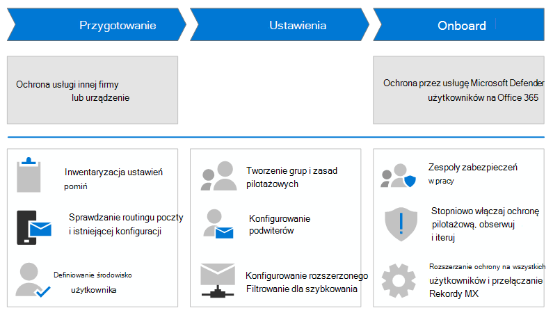

# Migrowanie z usługi lub urządzenia ochrony innej firmy do programu Microsoft Defender dla Office 365

**Dotyczy**
- [Microsoft Defender dla Office 365 plan 1 i plan 2](defender-for-office-365.md)

Jeśli masz już istniejącą usługę ochrony lub urządzenie innej firmy, które znajduje się przed programem Microsoft 365, możesz skorzystać z tego przewodnika, aby przeprowadzić migrację ochrony do usługi Microsoft Defender for Office 365, aby uzyskać korzyści wynikające ze skonsolidowanych funkcji zarządzania, potencjalnie zmniejszonych kosztów (przy użyciu produktów, za które już płacisz) oraz dla dorosłych i zintegrowanej ochrony zabezpieczeń. Aby uzyskać więcej informacji, zobacz [Program Microsoft Defender for Office](https://www.microsoft.com/security/business/threat-protection/office-365-defender).

W tym przewodniku przedstawiono konkretne kroki migracji z akcjami oraz podano następujące fakty:

- Masz już Microsoft 365 pocztowe, ale obecnie korzystasz z usługi lub urządzenia innej firmy do ochrony poczty e-mail. Poczta z Internetu przepływa za pośrednictwem usługi ochrony przed dostarczeniem do Twojej organizacji usługi Microsoft 365, Microsoft 365 ochrona jest jak najniżajsza (nigdy nie jest całkowicie wyłączona, na przykład zawsze jest wymuszana ochrona przed złośliwym oprogramowaniem).

  

- Jesteś poza fazą badania i rozważania w zakresie ochrony przez program Defender dla Office 365. Jeśli chcesz ocenić defender dla sieci Office 365 zdecydować, czy jest odpowiedni dla Twojej organizacji, zalecamy rozważenie trybu [oceny](office-365-evaluation.md).

- Masz już zakupioną usługę Defender Office 365 licencji.

- Należy wycofać istniejącą usługę ochrony innej firmy, co oznacza, że ostatecznie trzeba będzie wskazać rekordy MX domenom poczty e-mail, aby Microsoft 365. Gdy to zrobisz, poczta z Internetu będzie przepływać bezpośrednio do usługi Microsoft 365 i będzie chroniona wyłącznie przez usługi Exchange Online Protection (EOP) i Defender for Office 365.

  

Wyeliminowanie istniejącej usługi ochrony na rzecz usługi Defender for Office 365 jest dużym krokiem, który nie powinien być zbyt jasny i nie należy przedzierać się w celu zmiany. Wskazówki w tym przewodniku po migracji pomogą Uporządkowanie ochrony przy minimalnych zakłóceniach w pracy użytkowników.

Bardzo wysokie etapy migracji przedstawiono na poniższym diagramie. Rzeczywiste kroki znajdują się w sekcji o nazwie Proces [migracji w](#the-migration-process) dalszej części tego artykułu.

## Dlaczego warto skorzystać z instrukcji instrukcjami w tym przewodniku?

W branży IT niespodzianek na ogół niespodziewać są złe. Wystarczy przerzucić rekordy MX, aby wskazać Microsoft 365 bez uprzedniego i przemyślanego testowania spowoduje wiele niespodzianek. Przykład:

- Ty lub Twoi poprzedniki prawdopodobnie poświęcili dużo czasu i wysiłku na dostosowanie istniejącej usługi ochrony w celu optymalnego dostarczania poczty (czyli zablokowanie tego, co należy zablokować, i zezwolenie na to, co jest potrzebne). Niemal gwarantuje to, że nie wszystkie dostosowania bieżącej usługi ochrony są wymagane w usłudze Defender dla Office 365. Jest również bardzo możliwe, że usługa Defender for Office 365 wprowadzi nowe problemy (zezwalanie lub bloki), które nie wydarzyły się lub nie były wymagane w Bieżącej usłudze ochrony.
- Pracownicy pomocy technicznej i personelu zabezpieczeń muszą wiedzieć, co należy zrobić w programie Defender dla Office 365. Jeśli na przykład użytkownik skarży się na brak wiadomości, to czy pomoc do pomocy technicznej wie, gdzie lub jak ją szukać? Prawdopodobnie będą oni zaznajomieni z narzędziami w istniejącej usłudze ochrony, ale co z narzędziami w usłudze Defender dla systemu Office 365?

Z kolei jeśli będziesz postępować zgodnie z instrukcjami w tym przewodniku migracji, otrzymasz następujące korzyści dla migracji:

- Minimalne zakłócenia w pracy użytkowników.
- Dane celu programu Defender dla Office 365 których można użyć podczas raportów o postępie migracji i jej sukcesie w zarządzaniu.
- Wczesne zaangażowanie i instrukcje dla pracowników pomocy technicznej i personelu zabezpieczającego.

Im więcej poznasz tego, jak program Defender dla systemu Office 365 wpłynie na organizację, tym lepsze przejście będzie dla użytkowników, pracowników pomocy technicznej, pracowników bezpieczeństwa i kierownictwa.

Ten przewodnik po migracji udostępnia plan stopniowo "obracania pokrętła", który pozwala monitorować i testować, jak program Defender dla programu Office 365 wpływa na użytkowników i ich pocztę e-mail, dzięki czemu możesz szybko reagować na napotkane problemy.

## Proces migracji

Proces migrowania z usługi ochrony innej firmy do programu Defender Office 365 można podzielić na trzy fazy, jak opisano w poniższej tabeli:

****

|Faza|Opis|
|---|---|
|[Przygotowywanie do migracji](migrate-to-defender-for-office-365-prepare.md)|<ol><li>[Inwentaryzacja ustawień w istniejącej usłudze ochrony](migrate-to-defender-for-office-365-prepare.md#inventory-the-settings-at-your-existing-protection-service)</li><li>[Sprawdzanie istniejącej konfiguracji ochrony w programie Microsoft 365](migrate-to-defender-for-office-365-prepare.md#check-your-existing-protection-configuration-in-microsoft-365)</li><li>[Sprawdzanie konfiguracji routingu poczty](migrate-to-defender-for-office-365-prepare.md#check-your-mail-routing-configuration)</li><li>[Przenoszenie funkcji modyfikujących wiadomości do Microsoft 365](migrate-to-defender-for-office-365-prepare.md#move-features-that-modify-messages-into-microsoft-365)</li><li>[Definiowanie spamu i zbiorczego obsługi użytkowników](migrate-to-defender-for-office-365-prepare.md#define-spam-and-bulk-user-experiences)</li><li>[Identyfikowanie i wyznaczanie kont priorytetowych](migrate-to-defender-for-office-365-prepare.md#identify-and-designate-priority-accounts)</li></ol>|
|[Konfigurowanie usługi Defender dla Office 365](migrate-to-defender-for-office-365-setup.md)|<ol><li>[Tworzenie grup dystrybucyjnych dla użytkowników pilotażowych](migrate-to-defender-for-office-365-setup.md#step-1-create-distribution-groups-for-pilot-users)</li><li>[Konfigurowanie przesyłania użytkowników do raportowania wiadomości użytkownika](migrate-to-defender-for-office-365-setup.md#step-2-configure-user-submission-for-user-message-reporting)</li><li>[Obsługa lub tworzenie reguły przepływu poczty SCL=-1](migrate-to-defender-for-office-365-setup.md#step-3-maintain-or-create-the-scl-1-mail-flow-rule)</li><li>[Konfigurowanie ulepszonego filtrowania dla łączników](migrate-to-defender-for-office-365-setup.md#step-4-configure-enhanced-filtering-for-connectors)</li><li>[Tworzenie zasad ochrony pilotażowej](migrate-to-defender-for-office-365-setup.md#step-5-create-pilot-protection-policies)</li></ol>|
|[Onboard to Defender for Office 365](migrate-to-defender-for-office-365-onboard.md)|<ol><li>[Rozpoczynanie dołączania do Teams](migrate-to-defender-for-office-365-onboard.md#step-1-begin-onboarding-security-teams)</li><li>[(Opcjonalnie) Wykluczanie użytkowników pilotażowych z filtrowania według istniejącej usługi ochrony](migrate-to-defender-for-office-365-onboard.md#step-2-optional-exempt-pilot-users-from-filtering-by-your-existing-protection-service)</li><li>[Dostosowywanie spoof intelligence](migrate-to-defender-for-office-365-onboard.md#step-3-tune-spoof-intelligence)</li><li>[Dostosowywanie ochrony personifikacji i analizy skrzynki pocztowej](migrate-to-defender-for-office-365-onboard.md#step-4-tune-impersonation-protection-and-mailbox-intelligence)</li><li>[Używanie danych  przysyłanych przez użytkowników do mierzenia i dostosowania](migrate-to-defender-for-office-365-onboard.md#step-5-use-data-from-user-submissions-to-measure-and-adjust)</li><li>[(Opcjonalnie) Dodawanie kolejnych użytkowników do pilotażu i iteratu](migrate-to-defender-for-office-365-onboard.md#step-6-optional-add-more-users-to-your-pilot-and-iterate)</li><li>[Rozszerzanie Microsoft 365 na wszystkich użytkowników i wyłączanie reguły przepływu poczty SCL=-1](migrate-to-defender-for-office-365-onboard.md#step-7-extend-microsoft-365-protection-to-all-users-and-turn-off-the-scl-1-mail-flow-rule)</li><li>[Przełączanie rekordów MX](migrate-to-defender-for-office-365-onboard.md#step-8-switch-your-mx-records)</li></ol>|
|

## Następny krok

- Przejdź do [fazy 1. Przygotowywanie](migrate-to-defender-for-office-365-prepare.md).
