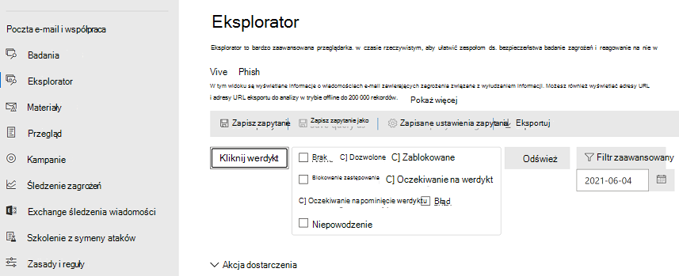
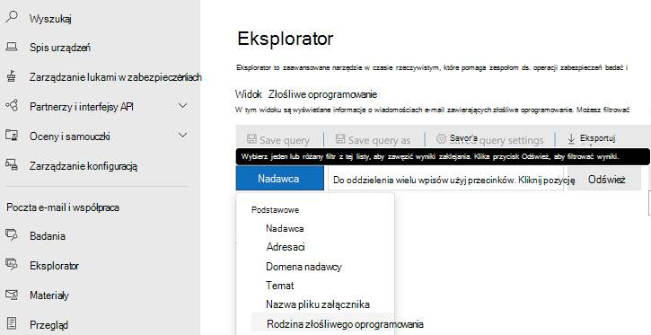

# Widoki w Eksploratorze zagrożeń i wykrywania w czasie rzeczywistym

[!INCLUDE [Microsoft 365 Defender rebranding](../includes/microsoft-defender-for-office.md)]

**Dotyczy**
- [Microsoft Defender dla Office 365 plan 1 i plan 2](defender-for-office-365.md)
- [Microsoft 365 Defender](../defender/microsoft-365-defender.md)

[Eksplorator zagrożeń](threat-explorer.md) (oraz raport wykrywania w czasie rzeczywistym) to zaawansowane narzędzie w czasie rzeczywistym, które pomaga zespołom operacji zabezpieczeń badać zagrożenia i odpowiadać na nie w portalu Microsoft 365 Defender rzeczywistym. W Eksploratorze (i raporcie wykrywania w czasie rzeczywistym) są wyświetlane informacje o podejrzanym złośliwym oprogramowaniu i wyłudzeniu informacji w wiadomościach e-mail i plikach w programie Office 365, a także o innych zagrożeniach i zagrożeniach bezpieczeństwa twojej organizacji.

- Jeśli masz program [Microsoft Defender dla Office 365](defender-for-office-365.md) Plan 2, to masz Eksploratora.
- Jeśli masz program Microsoft Defender dla Office 365 Plan 1, masz wykrywanie w czasie rzeczywistym.

Przy pierwszym otwarciu Eksploratora (lub raportu wykrywanie w czasie rzeczywistym) w widoku domyślnym są wykrywane złośliwe oprogramowanie w wiadomościach e-mail z ostatnich 7 dni. Ten raport może również zawierać program Microsoft Defender do wykrywania Office 365, takich jak złośliwe adresy URL wykryte w linkach programu [Sejf](safe-links.md) oraz złośliwych plików wykrytych przez załączniki Sejf[.](safe-attachments.md) Ten raport można zmodyfikować tak, aby zawierał dane z ostatnich 30 dni (za pomocą programu Microsoft Defender dla Office 365 P2). Subskrypcje wersji próbnej będą zawierać dane tylko z ostatnich siedmiu dni.

****

|Subskrypcja|Narzędzie|Dni danych|
|---|---|---|
|Program Microsoft Defender dla Office 365 P1|Wykrywanie w czasie rzeczywistym|7|
|Usługa Microsoft Defender dla Office 365 P1|Wykrywanie w czasie rzeczywistym|30|
|Usługa Microsoft Defender dla Office 365 P1 płatna wersja próbna programu Defender dla Office 365 P2|Eksplorator zagrożeń|7|
|Microsoft Defender dla Office 365 P2|Eksplorator zagrożeń|7|
|Usługa Microsoft Defender dla Office 365 P2|Eksplorator zagrożeń|30|
|

> [!NOTE]
> Wkrótce rozszerzymy limit przechowywania danych Eksploratora (i wykrywania w czasie rzeczywistym) i wyszukiwania dla dzierżaw wersji próbnej z 7 do 30 dni. Ta zmiana jest śledzona w ramach elementu planu nr 70544 i jest obecnie w fazie wdrażania.

Użyj menu **Widok** , aby zmienić wyświetlane informacje. Etykietki narzędzi ułatwiają określenie widoku, którego należy użyć.

Po wybraniu widoku możesz zastosować filtry i skonfigurować zapytania w celu przeprowadzenia dalszej analizy. Poniższe sekcje zawierają krótkie omówienie różnych widoków dostępnych w Eksploratorze (lub wykrywania w czasie rzeczywistym).

## Wiadomości e>-mail w celu złośliwego oprogramowania

Aby wyświetlić ten raport, w Eksploratorze (lub w czasie rzeczywistym) wybierz pozycję **Wyświetl złośliwe** **oprogramowanie poczty e-mail** \> \>. W tym widoku są wyświetlane informacje o wiadomościach e-mail zidentyfikowanych jako zawierające złośliwe oprogramowanie.

Kliknij **pozycję Nadawca** , aby otworzyć listę opcji wyświetlania. Ta lista umożliwia wyświetlanie danych według nadawcy, adresatów, domeny nadawcy, tematu, technologii wykrywania, stanu ochrony i nie tylko.

Aby na przykład sprawdzić, jakie działania zostały wykonane w związku z wykrytymi wiadomościami e-mail, wybierz z listy pozycję **Stan** ochrony. Wybierz opcję, a następnie kliknij przycisk Odśwież, aby zastosować ten filtr do raportu.

Poniżej wykresu wyświetl więcej szczegółowych informacji o konkretnych wiadomościach. Po zaznaczeniu elementu na liście zostanie otwarte okienko wysuwu, w którym możesz dowiedzieć się więcej o wybranym przez Ciebie pozycji.

## Wiadomości e-> Phish

Aby wyświetlić ten raport, w Eksploratorze (lub wykrywania w czasie rzeczywistym) wybierz pozycję **Wyświetl wiadomości** \> **e-mail** \> **phish**. W tym widoku są wyświetlane wiadomości e-mail zidentyfikowane jako próby wyłudzenia informacji.

Kliknij **pozycję Nadawca** , aby otworzyć listę opcji wyświetlania. Ta lista umożliwia wyświetlanie danych według nadawcy, adresatów, domeny nadawcy, adresu IP nadawcy, domeny adresu URL, kliknięcia werdyktu i nie tylko.

Aby na przykład sprawdzić, jakie akcje zostały wykonane, gdy ktoś kliknął adresy URL zidentyfikowane jako próby wyłudzenia informacji, wybierz  pozycję Kliknij werdykt na liście, wybierz jedną lub więcej opcji, a następnie kliknij przycisk Odśwież.

Poniżej wykresu wyświetl więcej szczegółów dotyczących określonych wiadomości, kliknięć adresów URL, adresów URL i pochodzenia wiadomości e-mail.

Po zaznaczeniu elementu na liście, na przykład adresu URL, który został wykryty, zostanie otwarte okienko wysuwu, w którym możesz dowiedzieć się więcej o wybranym przez Ciebie pozycji.

## Wysyłanie wiadomości > e-mail

Aby wyświetlić ten raport, w Eksploratorze (lub w czasie rzeczywistym) wybierz pozycję **Wyświetl** \> **przesłania wiadomości e-mail**\>. Ten widok przedstawia wiadomości e-mail zgłoszone przez użytkowników jako wiadomości-śmieci, a nie jako wiadomości-śmieci lub wiadomości wyłudzące informacje.

Kliknij **pozycję Nadawca** , aby otworzyć listę opcji wyświetlania. Ta lista umożliwia wyświetlanie informacji według nadawcy, adresatów, typu raportu (określenie przez użytkownika, że wiadomość e-mail jest śmieciem, wiadomością niebędąc śmieciem lub wiadomością wyłud treści) i nie tylko.

Aby na przykład wyświetlić informacje o wiadomościach e-mail zgłoszonych jako próby wyłudzenia  informacji, \> kliknij pozycję Typ raportu nadawcy **, wybierz** pozycję **Wyłudzanie**, a następnie kliknij przycisk Odśwież.

Poniżej wykresu wyświetl więcej szczegółowych informacji na temat określonych wiadomości e-mail, takich jak wiersz tematu, adres IP nadawcy, użytkownik, który zgłosił wiadomość jako wiadomość-śmieć, niebędąca śmieciem lub wiadomością wyłudząc itp.

Wybierz element z listy, aby wyświetlić dodatkowe szczegóły.

## Poczta e> e-mail

Aby wyświetlić ten raport, w Eksploratorze wybierz pozycję **Wyświetl całą pocztę** \> **e-mail**\>. W tym widoku można wyświetlić wszystkie dane dotyczące aktywności poczty e-mail, w tym wiadomości e-mail zidentyfikowane jako złośliwe ze względu na wyłudzanie informacji lub złośliwe oprogramowanie, a także wszystkie niechciane wiadomości (normalne wiadomości e-mail, spam i poczta masowa).

> [!NOTE]
> Jeśli zostanie komunikat o błędzie z komunikatem Zbyt wiele danych do **wyświetlenia, dodaj** filtr i w razie potrzeby zawęzij wyświetlany zakres dat.

Aby zastosować filtr, wybierz pozycję **Nadawca**, wybierz element na liście, a następnie kliknij przycisk Odśwież. W naszym przykładzie u używaliśmy technologii **wykrywania** jako filtru (dostępnych jest kilka opcji). Możesz wyświetlać informacje według nadawcy, domeny nadawcy, adresatów, tematu, nazwy pliku załącznika, rodziny złośliwego oprogramowania, stanu ochrony (czynności podejmowane przez funkcje i zasady ochrony przed zagrożeniami w programie Office 365), technologii wykrywania (jak wykryto złośliwe oprogramowanie) i nie tylko.

Poniżej wykresu wyświetl więcej szczegółowych informacji o konkretnych wiadomościach e-mail, takich jak temat, adresat, nadawca, status itp.

## Oprogramowanie > zawartości

Aby wyświetlić ten raport, w Eksploratorze (lub wykrywanie w czasie rzeczywistym) wybierz pozycję **Wyświetl złośliwe** \> **oprogramowanie** \> **zawartości**. W tym widoku są dostępne pliki, które zostały zidentyfikowane jako złośliwe przez usługę [Microsoft Defender dla Office 365 usługi SharePoint Online, OneDrive dla Firm i Microsoft Teams](mdo-for-spo-odb-and-teams.md).

Wyświetlaj informacje według rodziny złośliwego oprogramowania, technologii wykrywania (jak wykryto złośliwe oprogramowanie) i obciążenia pracą (OneDrive, SharePoint lub Teams).

Poniżej wykresu wyświetl więcej szczegółowych informacji na temat określonych plików, takich jak nazwa pliku załącznika, obciążenie pracą, rozmiar pliku, kto ostatnio zmodyfikował plik i nie tylko.

## Funkcje "Kliknij, aby filtrować"

Za pomocą Eksploratora (i wykrywania w czasie rzeczywistym) możesz zastosować filtr jednym kliknięciem. Kliknij element w legendzie, a ten element stanie się filtrem raportu. Załóżmy na przykład, że przeglądamy widok Złośliwe oprogramowanie w Eksploratorze:

Kliknięcie **przycisku DEtonacja ATP** na tym wykresie powoduje wyświetlenie widoku w ten sposób:

Teraz w tym widoku przeglądamy dane dotyczące plików, które zostały zdetonowane przez Sejf [załączników](safe-attachments.md). Poniżej wykresu widać szczegółowe informacje o konkretnych wiadomościach e-mail, które miały załączniki wykryte przez Sejf załączników.

Wybranie jednego lub większej liczby elementów aktywuje menu **Akcje** , które oferuje kilka opcji, z których można wybrać dla wybranych elementów.

Możliwość filtrowania jednym kliknięciem i przechodzenia do określonych szczegółów pozwala zaoszczędzić sporo czasu podczas badania zagrożeń.

## Zapytania i filtry

Eksplorator (a także raport wykrywanie w czasie rzeczywistym) zawiera kilka zaawansowanych filtrów i funkcji zapytań, które umożliwiają przechodzenie do szczegółów, takich jak najokierni użytkownicy, najgorętsi rodziny złośliwego oprogramowania, technologia wykrywania i nie tylko. Każdy rodzaj raportu oferuje różne sposoby wyświetlania i eksplorowanie danych.

> [!IMPORTANT]
> Nie używaj symboli wieloznacznych, takich jak gwiazdka lub znak zapytania, na pasku zapytania w Eksploratorze (ani w czasie rzeczywistym). Podczas wyszukiwania w polu Temat  wiadomości e-mail Eksplorator (lub wykrywania w czasie rzeczywistym) wykona częściowe dopasowywanie i da wyniki podobne do wyszukiwania z symbolami wieloznacznych.
