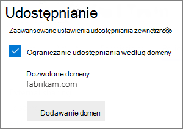
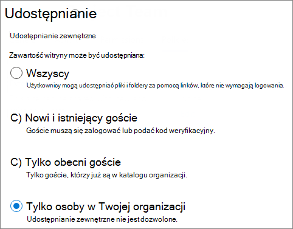
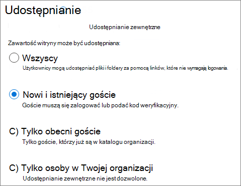

# <a name="limit-sharing-in-microsoft-365"></a>Ograniczanie udostępniania w Microsoft 365

Chociaż nie można całkowicie wyłączyć udostępniania wewnętrznego ani usunąć przycisku Udostępnij z witryn, istnieje wiele sposobów ograniczenia udostępniania w programie Microsoft 365 w celu zaspokojenia potrzeb organizacji.

Metody udostępniania plików wymieniono w poniższej tabeli. Kliknij link w kolumnie **Metoda udostępniania** , aby uzyskać szczegółowe informacje.

|Metoda udostępniania|Opis|Opcje ograniczenia|
|:-------------|:----------|:-------------|
|[Microsoft 365 grupy lub zespołu](#microsoft-365-group-or-team)|Osoby udzieliły dostępu do zespołu Microsoft Teams lub grupy Microsoft 365 mają dostęp do edycji plików w skojarzonej SharePoint sieci Web.|Jeśli grupa lub zespół jest prywatną, zaproszenia do dołączenia do zespołu należy do właściciela w celu zatwierdzenia. Administratorzy mogą wyłączyć dostęp gości lub użyć etykiet wrażliwości, aby uniemożliwić dostęp osobom spoza organizacji.|
|[SharePoint witryny](#sharepoint-site)|Użytkownikom można przyznać dostęp właściciela, członka lub gościa do witryny SharePoint, który zapewnia taki poziom dostępu do plików w witrynie.|Uprawnienia witryny można ograniczyć, tak aby tylko właściciele witryn mogą ją udostępniać. Administratorzy mogą ustawić witrynę jako dostęp tylko do odczytu lub całkowicie zablokować dostęp.|
|[Udostępnianie określonym osobom](#sharing-with-specific-people)|Członkowie witryny i osoby z uprawnieniami do edytowania mogą bezpośrednio udzielać uprawnień do plików i folderów lub udostępniać je za pomocą *linków Określone* osoby.|Uprawnienia witryny można ograniczyć, tak aby tylko właściciele witryn mogą udostępniać pliki i foldery. W takim przypadku bezpośredni dostęp i *udostępnianie linku* Określone osoby przez członków witryny trafiają do właściciela witryny w celu zatwierdzenia.|
|[SharePoint i OneDrive udostępniania gościa](#sharepoint-guest-sharing)|SharePoint, członkowie i współwłaścicieli OneDrive mogą udostępniać pliki i foldery osobom spoza organizacji.|Udostępnianie gości można wyłączyć w całej organizacji lub dla poszczególnych witryn.|
|[*Osoby w Twojej organizacji, linki* do udostępniania](#people-in-your-organization-sharing-links)|SharePoint i członkowie witryny mogą udostępniać pliki za pomocą linków Osoby w  organizacji, które będą działać dla wszystkich osób w organizacji.|*Linki osób w twojej* organizacji można wyłączyć na poziomie witryny.|
|[Tworzenie witryn, grup i zespołów](#create-sites-groups-and-teams)|Domyślnie użytkownicy mogą tworzyć nowe witryny, grupy i zespoły, z których mogą udostępniać zawartość.|Administratorzy mogą ograniczyć liczbę osób, które mogą tworzyć witryny, grupy i zespoły.|
|[Poczta e-mail](#email)|Osoby z dostępem do pliku mogą wysłać go do innych osób pocztą e-mail.|Administratorzy mogą szyfrować pliki, używając etykiet wrażliwości, aby zapobiec ich udostępnianiu nieautoryzowanym osobom.|
|[Pobieranie lub kopiowanie pliku](#download-or-file-copy)|Osoby z dostępem do pliku mogą go pobrać lub skopiować i udostępnić innym osobom poza zakresem Microsoft 365.|Administratorzy mogą szyfrować pliki, używając etykiet wrażliwości, aby zapobiec ich udostępnianiu nieautoryzowanym osobom.|

Możesz także ograniczyć warunki, na podstawie których osoby mają dostęp do udostępnionej zawartości. Aby [uzyskać więcej informacji](#conditional-access) , zobacz dostęp warunkowy w dalszej części tego artykułu.

Chociaż w celu ograniczenia udostępniania w organizacji możesz używać kontrolek administratora opisanych w tym artykule, zalecamy użycie funkcji zabezpieczeń i zgodności dostępnych w programie Microsoft 365 w celu utworzenia bezpiecznego środowiska udostępniania. Zobacz [Współpraca nad plikami SharePoint za pomocą Microsoft 365](/sharepoint/deploy-file-collaboration) i Konfigurowanie [zespołu z izolacji](secure-teams-security-isolation.md) zabezpieczeń dla informacji.

Aby dowiedzieć się, jak jest używane udostępnianie w organizacji, uruchom raport na temat udostępniania [plików i folderów](/sharepoint/sharing-reports).

## <a name="microsoft-365-group-or-team"></a>Microsoft 365 grupy lub zespołu

Aby ograniczyć udostępnianie w grupie Microsoft 365 zespołu lub zespołu Microsoft Teams, należy sprawić, aby grupa lub zespół był prywatny. Osoby w Twojej organizacji mogą w dowolnej chwili dołączyć do grupy publicznej lub zespołu. O ile grupa lub zespół nie jest prywatny, nie ma żadnego sposobu na ograniczenie udostępniania zespołu ani jego plików w organizacji.

### <a name="guest-sharing"></a>Udostępnianie gości

Jeśli chcesz uniemożliwić dostęp dla gościa w Teams, możesz wyłączyć udostępnianie gości w Teams administracyjnym.

Aby wyłączyć udostępnianie gościa dla Teams
1. W centrum Teams rozwiń pozycję **Ustawienia dla całej organizacjiNajest** >  <a href="https://go.microsoft.com/fwlink/p/?linkid=2173122" target="_blank">**karta dostępu**</a>.
2. Wyłącz **zezwalanie na dostęp gościa w aplikacji Teams**.
3. Kliknij **Zapisz**.

Jeśli chcesz uniemożliwić dostęp gościom w grupach Microsoft 365, możesz wyłączyć ustawienia dostępu gościa grup w centrum administracyjne platformy Microsoft 365.

Aby wyłączyć udostępnianie gości w Microsoft 365 Grupy
1. W centrum administracyjne platformy Microsoft 365 kliknij pozycję **Ustawienia** >  **Org Ustawienia** >  <a href="https://go.microsoft.com/fwlink/p/?linkid=2053743" target="_blank">**Services**</a>.
2. Kliknij **Microsoft 365 grupy**.
3. Wyczyść pola **wyboru Pozwalaj członkom grupy** spoza organizacji na uzyskiwanie dostępu do zawartości grupy i Pozwól właścicielom grup dodawać osoby spoza organizacji **do** grup.
4. Kliknij przycisk **Zapisz zmiany**.

    

> [!NOTE]
> Jeśli chcesz uniemożliwić udostępnianie gości dla określonej grupy lub zespołu, możesz to zrobić przy użyciu programu [Microsoft PowerShell](per-group-guest-access.md) lub [etykiet wrażliwości](../compliance/sensitivity-labels-teams-groups-sites.md).

Możesz ograniczyć udostępnianie gości do użytkowników z określonych domen, zezwalając na domeny w Azure Active Directory. Wpływa to również na udostępnianie gości w usłudze SharePoint, jeśli włączono integrację usług [SharePoint i OneDrive z usługą Azure AD B2B](/sharepoint/sharepoint-azureb2b-integration-preview).

Aby zezwolić na zaproszenia do udostępniania tylko z określonych domen
1. W Azure Active Directory na stronie Przegląd kliknij pozycję **Relacje organizacyjne**.
2. Kliknij **Ustawienia**.
3. W **obszarze Ograniczenia współpracy** **wybierz pozycję** Odmów zaproszeń do określonych domen lub Zezwalaj na zaproszenia tylko do określonych **domen, a** następnie wpisz domeny, których chcesz użyć.
4. Kliknij **Zapisz**.

    

## <a name="sharepoint-site"></a>SharePoint witryny

Udostępnianie witryn SharePoint tylko właścicielom witryn. Uniemożliwia to członkom witryny udostępnianie witryny. Pamiętaj, że jeśli witryna jest połączona z grupą Microsoft 365, członkowie grupy mogą zapraszać inne osoby do grupy, a ci użytkownicy będą mieli dostęp do witryny.

Aby ograniczyć udostępnianie witryny do właścicieli
1. W witrynie kliknij ikonę koła zębatego, a następnie kliknij pozycję **Uprawnienia witryny**.
2. W **obszarze Ustawienia udostępniania** kliknij **pozycję Zmień ustawienia udostępniania**.
3. Wybierz **pozycję Właściciele i członkowie witryny, a osoby z** uprawnieniami do edytowania mogą udostępniać pliki i foldery, ale tylko właściciele witryn mogą udostępniać witrynę.
4. Kliknij **Zapisz**.

    

Możesz uniemożliwić użytkownikom, którzy nie są członkami witryny, żądanie dostępu przez wyłączenie żądań dostępu.

Aby wyłączyć żądania dostępu
1. W witrynie kliknij ikonę koła zębatego, a następnie kliknij pozycję **Uprawnienia witryny**.
2. W **obszarze Ustawienia udostępniania** kliknij **pozycję Zmień ustawienia udostępniania**.
3. Wyłącz opcję **Zezwalaj na żądania dostępu**, a następnie kliknij przycisk **Zapisz**.

Możesz ograniczyć udostępnianie witryn do określonych domen, zezwalając na domeny danej witryny lub blokując je.

Aby ograniczyć udostępnianie witryny według domeny
1. W centrum SharePoint administracyjnego w obszarze **Witryny** kliknij pozycję **Aktywne witryny**.
2. Kliknij witrynę, którą chcesz skonfigurować.
3. Na karcie **Zasady** w obszarze Udostępnianie **zewnętrzne** kliknij pozycję **Edytuj**.
4. W **obszarze Zaawansowane ustawienia udostępniania zewnętrznego** wybierz **pozycję Ogranicz udostępnianie według domeny**.
5. Dodaj domeny, które chcesz zezwolić lub zablokować, a następnie kliknij przycisk **Zapisz**.
6. Kliknij **Zapisz**.

    

### <a name="block-access-to-a-site"></a>Blokowanie dostępu do witryny

Możesz zablokować dostęp do witryny lub ustawić witrynę jako tylko do odczytu, zmieniając stan blokady witryny. Aby uzyskać szczegółowe informacje, [zobacz Blokowanie i odblokowywanie witryn](/sharepoint/manage-lock-status).

### <a name="permissions-inheritance"></a>Dziedziczenie uprawnień

Chociaż nie jest to zalecane, możesz SharePoint [dziedziczenie uprawnień](/sharepoint/what-is-permissions-inheritance), aby dostosować poziomy dostępu do witryn i podwitryn.

## <a name="sharing-with-specific-people"></a>Udostępnianie określonym osobom

jeśli chcesz ograniczyć udostępnianie witryny lub jej zawartości, możesz skonfigurować witrynę tak, aby zezwalała tylko właścicielom witryn na udostępnianie plików, folderów i witryny. Po skonfigurowaniu tej konfiguracji próby udostępnienia plików lub folderów przez członków witryny przy użyciu linków Określone osoby  zostaną zatwierdzone do właściciela witryny.

Aby ograniczyć udostępnianie witryn, plików i folderów do właścicieli
1. W witrynie kliknij ikonę koła zębatego, a następnie kliknij pozycję **Uprawnienia witryny**.
2. W **obszarze Ustawienia udostępniania** kliknij **pozycję Zmień ustawienia udostępniania**.
3. Wybierz **pozycję Tylko właściciele witryny mogą udostępniać pliki, foldery i witrynę**.
4. Kliknij **Zapisz**.

    

## <a name="sharepoint-guest-sharing"></a>SharePoint udostępniania gościa

Jeśli chcesz zapobiec udostępnianiu SharePoint lub OneDrive i folderów osobom spoza organizacji, możesz wyłączyć udostępnianie gości w całej organizacji lub dla poszczególnych witryn.

Aby wyłączyć SharePoint udostępniania gościa w organizacji
1. W centrum SharePoint w obszarze **Zasady** kliknij pozycję **Udostępnianie**.
2. W **obszarze Udostępnianie zewnętrzne** przeciągnij suwak SharePoint w dół do ustawienia Tylko osoby **w organizacji**.
3. Kliknij **Zapisz**.

    


Aby wyłączyć udostępnianie gości w witrynie
1. W centrum SharePoint administracyjnego w obszarze **Witryny** kliknij pozycję **Aktywne witryny**.
2. Kliknij witrynę, którą chcesz skonfigurować.
3. Na karcie **Zasady** w obszarze Udostępnianie **zewnętrzne** kliknij pozycję **Edytuj**.
4. W **obszarze Udostępnianie zewnętrzne** wybierz **pozycję Tylko osoby w Twojej organizacji**, a następnie kliknij przycisk **Zapisz**.

    

Możesz wyłączyć udostępnianie gości dla poszczególnych OneDrive, klikając odpowiedniego użytkownika w centrum administracyjne platformy Microsoft 365 i wybierając pozycję Zarządzaj udostępnianiem zewnętrznym **na OneDrive** karcie Udostępnianie.

Jeśli chcesz zezwolić na udostępnianie osobom spoza organizacji, ale chcesz się upewnić, że wszyscy się uwierzytelniają, możesz wyłączyć linki *Każda osoba (* udostępnianie anonimowe) w całej organizacji lub dla poszczególnych witryn.

Aby wyłączyć linki *Każdy* na poziomie organizacji
1. W centrum SharePoint w obszarze **Zasady** kliknij pozycję **Udostępnianie**.
2. W **obszarze Udostępnianie zewnętrzne** przeciągnij suwak SharePoint w dół do **pola Nowi i istniejący goście**.
3. Kliknij **Zapisz**.

    

Aby wyłączyć linki *Każdy* dla witryny
1. W centrum SharePoint administracyjnego w obszarze **Witryny** kliknij pozycję **Aktywne witryny**.
2. Kliknij witrynę, którą chcesz skonfigurować.
3. Na karcie **Zasady** w obszarze Udostępnianie **zewnętrzne** kliknij pozycję **Edytuj**.
4. W **obszarze Udostępnianie zewnętrzne** wybierz **pozycję Nowi i istniejący goście**, a następnie kliknij przycisk **Zapisz**.

    

## <a name="people-in-your-organization-sharing-links"></a>*Osoby w Twojej organizacji, linki* do udostępniania

Domyślnie członkowie witryny mogą udostępniać pliki i foldery innym osobom w organizacji przy użyciu linku Osoby *w organizacji* . Linki osób *w organizacji można wyłączyć przy* użyciu programu PowerShell:

```powershell
Set-SPOSite -Identity <site> -DisableCompanyWideSharingLinks Disabled
```

Przykład:

```powershell
Set-SPOSite -Identity https://contoso.sharepoint.com -DisableCompanyWideSharingLinks Disabled
```

## <a name="create-sites-groups-and-teams"></a>Tworzenie witryn, grup i zespołów

Domyślnie użytkownicy mogą tworzyć nowe witryny, grupy i zespoły, z których mogą udostępniać zawartość (w zależności od twoich ustawień udostępniania). Możesz ograniczyć liczbę osób, które mogą tworzyć witryny, grupy i zespoły. Zobacz następujące odwołania:

- [Zarządzanie tworzeniem witryn w SharePoint](/sharepoint/manage-site-creation)
- [Zarządzanie tym, kto może tworzyć Microsoft 365 grupy](./manage-creation-of-groups.md)

> [!NOTE]
> Ograniczanie możliwości tworzenia grup ogranicza tworzenie  zespołu.

## <a name="email"></a>Poczta e-mail

Szyfrowanie pozwala zapobiec niechcianym udostępnianiu wiadomości e-mail. Zapobiega to przesyłaniu dalej wiadomości e-mail lub udostępniniu ich w inny sposób nieautoryzowanym użytkownikom. Szyfrowanie wiadomości e-mail można włączyć przy użyciu etykiet wrażliwości. Aby [uzyskać szczegółowe informacje, zobacz Ograniczanie dostępu do zawartości przy użyciu szyfrowania etykiet wrażliwości](../compliance/encryption-sensitivity-labels.md) .

## <a name="download-or-file-copy"></a>Pobieranie lub kopiowanie pliku

Użytkownicy, którzy mają dostęp do plików i folderów w aplikacji Microsoft 365 mogą pobierać pliki i kopiować je do multimediów zewnętrznych. Aby zmniejszyć ryzyko niechcianego udostępniania plików, możesz zaszyfrować zawartość przy użyciu etykiet wrażliwości.

## <a name="conditional-access"></a>Dostęp warunkowy

Azure Active Directory dostępu warunkowego są dostępne opcje ograniczenia lub zapobiegania udostępnianiu osobom na podstawie lokalizacji sieciowej, kondycji urządzenia, ryzyka logowania i innych czynników. Zobacz [Co to jest dostęp warunkowy?](/azure/active-directory/conditional-access/overview).

SharePoint bezpośrednią integrację z dostępem warunkowym usługi Azure AD zarówno dla urządzeń niezawiązyanych, jak i dla lokalizacji sieciowej. Aby uzyskać szczegółowe informacje, zobacz następujące odwołania:

- [Sterowanie dostępem z poziomu urządzeń niezarządzanych](/sharepoint/control-access-from-unmanaged-devices)
- [Kontrolowanie dostępu do SharePoint i OneDrive danych na podstawie lokalizacji sieciowej](/sharepoint/control-access-based-on-network-location)

## <a name="see-also"></a>Zobacz też

[Informacje dotyczące ustawień udostępniania dla gości na platformie Microsoft 365](microsoft-365-guest-settings.md)
