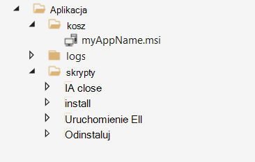
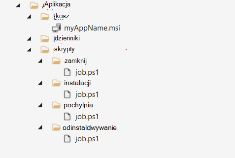
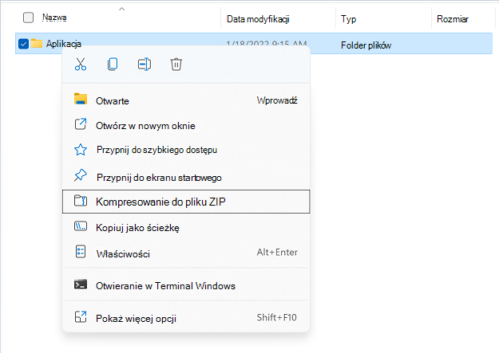

# <a name="build-a-package"></a>Tworzenie pakietu

Pakiet jest plikiem .zip zawierającym skrypty binarne i testowe aplikacji, co jest warunkiem wstępnym korzystania z bazy testowej. Ten przewodnik Szybki start przeprowadzi Cię przez proces tworzenia pierwszego pakietu, za pomocą którego można przeprowadzić testowanie out-of-box w aplikacji.

- *Test **out-of-box (OOB)** przeprowadza instalację, uruchamianie, zamykanie i odinstalowywanie aplikacji. Po zainstalowaniu procedura zamykania uruchamiania jest powtarzana 30 razy przed uruchomieniem pojedynczego odinstalowywania. Test OOB zapewnia ustandaryzowane dane telemetryczne w pakiecie do porównania między Windows kompilacjami.*

Opcjonalnie możesz pobrać nasz [przykładowy pakiet](https://aka.ms/testbase-sample-package) , aby odwołać się i zacząć od.

## <a name="create-a-folder-structure"></a>Tworzenie struktury folderów

Na komputerze lokalnym utwórz strukturę folderów w następujący sposób:


Te foldery są używane:

- **App\bin**: zapisz pliki binarne aplikacji i zależności.
- **App\scripts**: zapisz skrypty do instalowania, uruchamiania, zamykania i odinstalowywania aplikacji.
- **App\logs**: skrypty powinny wyprowadzać dzienniki do tego folderu, a następnie można pobierać i analizować dzienniki po zakończeniu testu.

## <a name="copy-binary-files"></a>Kopiowanie plików binarnych

Skopiuj pliki instalacyjne aplikacji do **pliku App\bin**. Jeśli aplikacja ma zależności, należy je najpierw zainstalować. Skopiuj również pliki instalacyjne zależności do **pliku App\bin**.



## <a name="add-powershell-scripts"></a>Dodawanie skryptów programu PowerShell

Aby przeprowadzić test OOB, należy dodać skrypty programu PowerShell do instalowania, uruchamiania, zamykania i odinstalowywania aplikacji.

> [!NOTE]
> *W teście OOB wymagane są skrypty instalowania, uruchamiania i zamykania, a skrypt odinstalowywania jest opcjonalny*.

Skrypt powinien zostać dodany do folderu w następujący sposób:



Skrypt zwykle zawiera następujące zachowania:

- **Uruchom polecenia, aby zainstalować/uruchomić/zamknąć/odinstalować aplikację**. Jeśli na przykład aplikacja jest plikiem MSI, uruchom [polecenie msiexec](/windows-server/administration/windows-commands/msiexec) , aby go zainstalować.
- **Sprawdź wynik operacji instalowania/uruchamiania/zamykania/odinstalowywania**, jeśli wynik jest oczekiwany, zwróć zero kodu zakończenia. Baza testowa oznaczy uruchomienie skryptu jako niepowodzenie, jeśli zwróci kod zakończenia inny niż zero.
- **Zapisz wystarczającą liczbę dzienników**, zapisz odpowiednie dzienniki do użycia w przyszłości.

Zapoznaj się z poniższymi przykładami. Możesz po prostu skopiować je do plików i odpowiednio wprowadzić zmiany.

**Przykład skryptu instalacji (App\scripts\install\job.ps1)**:

```powershell
        push-location $PSScriptRoot
        $exit_code = 0
        $script_name = $myinvocation.mycommand.name
        $log_dir = "$PSScriptRoot\..\..\logs"
        $log_file = "$log_dir\$script_name.log"

        if(-not (test-path -path $log_dir )) {
            new-item -itemtype directory -path $log_dir
        }

        Function log {
           Param ([string]$log_string)
           write-host $log_string
           add-content $log_file -value $log_string
        }

        log("Installing TestBaseM365 Digital Clock")
        push-location "..\..\bin"
        if ([Environment]::Is64BitProcess) {
            $installer_name = "TestBaseM365DigitalClock.msi"
        }
        else {
            $installer_name = "TestBaseM365DigitalClock.msi"
        }
        $arguments = "/i "+$installer_name+" /quiet /L*v "+"$log_dir"+"\atp-client-installation.log"

        $installer = Start-Process msiexec.exe $arguments -wait -passthru
        pop-location

        if ($installer.exitcode -eq 0) {
            log("Installation succesful as $($installer.exitcode)")
        }
        else {
            log("Error: Installation failed as $($installer.exitcode)")
            $exit_code = $installer.exitcode
        }

        log("Installation script finished as $exit_code")
        pop-location
        exit $exit_code
```

**Przykład skryptu uruchamiania (App\scripts\launch\job.ps1)**:

```powershell
        push-location $PSScriptRoot
        $exit_code = 0
        $script_name = $myinvocation.mycommand.name
        $log_dir = "$PSScriptRoot\..\..\logs"
        $log_file = "$log_dir\$script_name.log"

        if(-not (test-path -path $log_dir )) {
            new-item -itemtype directory -path $log_dir
        }

        Function log {
           Param ([string]$log_string)
           write-host $log_string
           add-content $log_file -value $log_string
        }

        log("Launch TestBaseM365 Digital Clock")

        $PROCESS_NAME = "DigitalClock"
        $exePath = "C:\Program Files\Test Base M365\DigitalClock\DigitalClock.exe"

        Start-Process -FilePath $exePath

         if (Get-Process -Name $PROCESS_NAME) {
                log("Launch successfully $PROCESS_NAME...")
                $exit_code = 0
         }
         else {
            log("Not launched $PROCESS_NAME...")
            $exit_code = 1
         }

        log("Launch script finished as $exit_code")
        pop-location
        exit $exit_code
```

## <a name="compress-to-zip-file"></a>Kompresuj do pliku zip

Po przygotowaniu skryptów i plików binarnych kompresujesz folder do pliku zip. Kliknij prawym przyciskiem myszy folder Aplikacji, wybierz pozycję **Kompresuj do pliku ZIP**.



## <a name="verify-your-package-locally-optional"></a>Weryfikowanie pakietu lokalnie (opcjonalnie)

Po utworzeniu pakietu zip możesz przekazać go do konta bazy testów.

Jednak najlepszym rozwiązaniem jest uruchomienie testu lokalnie, aby upewnić się, że skrypty działają prawidłowo przed przekazaniem. Test lokalny może szybko identyfikować problemy i przyspieszyć proces przekazywania. Aby zweryfikować lokalnie, wykonaj poniższe kroki:

1. Przygotowywanie maszyny wirtualnej (maszyny wirtualnej)

   Zalecamy używanie maszyny wirtualnej do tego testu lokalnego, ponieważ dla każdego testu jest obecnie potrzebne czyste środowisko Windows. Łatwo jest utworzyć maszynę wirtualną Windows na platformie Azure ([Szybki start: Windows maszyny wirtualnej](/azure/virtual-machines/windows/quick-create-portal)), możesz wybrać odpowiednią wersję Windows (obraz) na potrzeby testu, np *. Windows 10 Pro, wersja 21H2.*<br>

2. Kopiowanie pakietu na maszynę wirtualną

   Istnieje wiele sposobów kopiowania pliku pakietu na maszynę wirtualną. Jeśli używasz maszyny wirtualnej platformy Azure, możesz wybrać następujące opcje:

     - Skopiuj plik bezpośrednio w połączeniu pulpitu zdalnego.
     - Korzystanie z udziału plików platformy Azure ([Szybki start: tworzenie pliku platformy Azure i zarządzanie nimi](/azure/storage/files/storage-files-quick-create-use-windows))

   Możesz utworzyć określony folder dla tego testu i skopiować plik pakietu w tym folderze. np. *C:\TestBase*.

3. Testowanie pakietu

   Otwórz Windows PowerShell, przejdź do katalogu zawierającego pakiet, np. `cd C:\TestBase`, i rozpocznij uruchamianie testów w pakiecie:

   1. Wyodrębnij plik pakietu.

      ```powershell
      Expand-Archive -LiteralPath C:\TestBase\App.zip -DestinationPath C:\TestBase
      ```

   2. Uruchom skrypt instalacji.

      ```powershell
      C:\TestBase\App\scripts\install\job.ps1
      ```

   3. W razie potrzeby uruchom ponownie maszynę wirtualną.

   4. Uruchom skrypt uruchamiania.

      ```powershell
      C:\TestBase\App\scripts\install\job.ps1
      ```

   5. Uruchom zamknij skrypt.

      ```powershell
      C:\TestBase\App\scripts\close\job.ps1
      ```

   6. Uruchom skrypt odinstalowywania (jeśli go masz).

      ```powershell
      C:\TestBase\App\scripts\uninstall\job.ps1
      ```

Po każdym kroku możesz sprawdzić, czy w skryptze występują jakiekolwiek problemy. Jeśli wszystkie skrypty działają zgodnie z oczekiwaniami, pakiet jest gotowy do przekazania na konto bazy testowej.

## <a name="next-steps"></a>Następne kroki

[Upload pakietu](uploadApplication.md)
